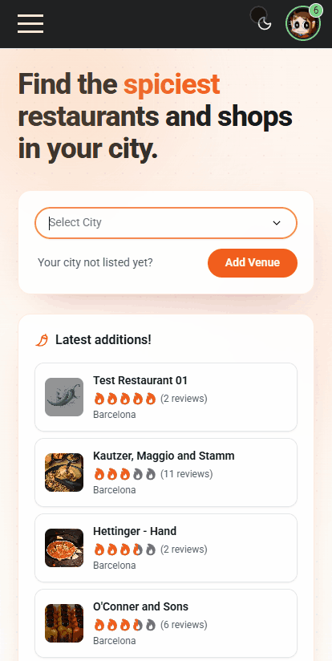
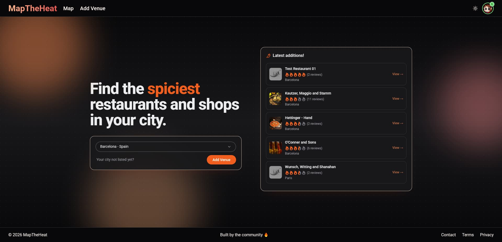
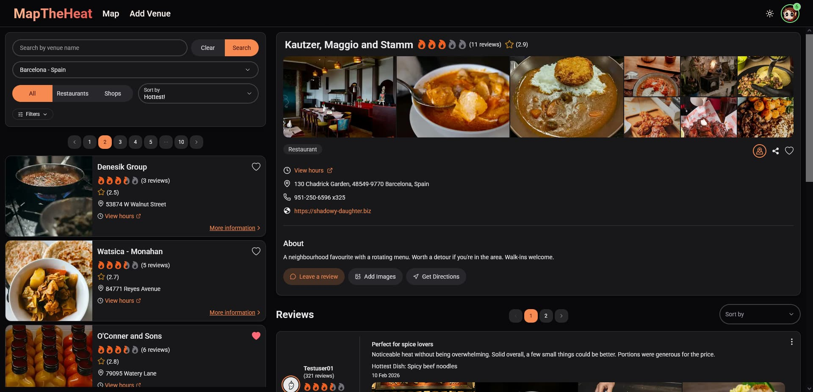
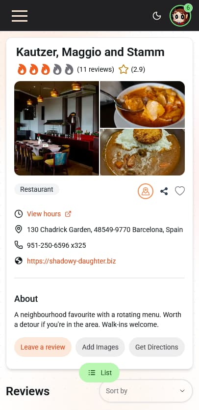
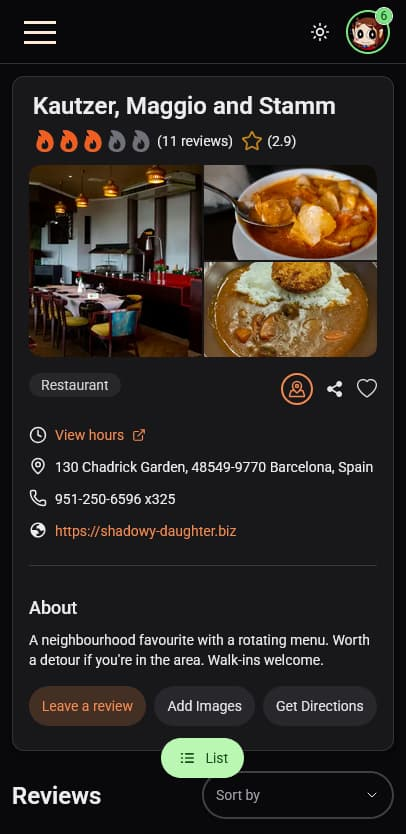

# 🌶 MapTheHeat

MapTheHeat is a React + TypeScript application for discovering the _spiciest_ restaurants and shops in your city, powered by real user activity.

Users can browse venues via list or map, submit new venues and reviews with images, save favourites, and manage their profile. All user-generated content passes through a moderation queue with automated notifications.

The app is live and actively evolving, with moderation, SEO and observability built out end to end.

---

## 🌍 Live Site

**Production:** https://maptheheat.com  
**Staging:** https://staging.maptheheat.com, pre-populated with seeded demo data for easy exploration

Both environments are fully functional and run against independent Supabase projects.

---

## 📸 Screenshots

**Browsing and filtering venues**



**Desktop**





**Mobile (light and dark)**

<p>
  
  &nbsp;&nbsp;
  
</p>

---

## ✨ Features

**Discovery**

- Interactive Leaflet map with city/category filters
- List view with multi-axis sorting (heat, quality, recency)
- Per-venue detail pages with photos, reviews and aggregate ratings

**Submissions**

- Address autocomplete via the **Mapbox Geocoding API**, returning structured address components and coordinates in a single selection
- Add/edit reviews with heat and quality ratings
- Image uploads attached to a venue, a review, or as standalone galleries (FilePond + react-easy-crop + browser-image-compression)
- All submissions enter a pending moderation queue

**Profiles & engagement**

- Save venues to favourites
- In-app notifications for moderation outcomes
- Profile page with reviews, favourites, notifications, and account management (email, password, username, avatar)
- Google OAuth + email/password sign-in via Supabase Auth

**Admin**

- Moderation panel for venues, reviews and image sets
- Set venue thumbnails directly from moderation
- Composable notification messages to users on approve/reject

### Moderation & backend rules

Limits and authorisation are enforced **at the database layer**. The client is not the source of truth.

- Max 2 pending venues, 2 pending reviews, and 2 pending image sets per user
- Enforced via Postgres functions, Row-Level Security, and triggers
- Admin checks via a dedicated `user_roles` table and `is_admin()` SECURITY DEFINER function with explicit `search_path`
- Client-side mirrors the same rules for fast, friendly feedback

---

## 🛠 Tech Stack

**Frontend**

- React 18 + TypeScript (strict mode)
- Vite
- Tailwind CSS + HeroUI
- TanStack React Query
- React Router v6
- React Hook Form
- Leaflet / React Leaflet
- Mapbox Geocoding API
- react-helmet-async (per-page SEO metadata)

**Backend**

- Supabase: Postgres, Auth, Storage
- Cloudflare Pages Functions (edge prerendering, see SEO below)

**Observability & operations**

- Sentry: error tracking with uploaded source maps and Replay (10% session / 100% on-error)
- Cloudflare Web Analytics: cookieless, GDPR-friendly, no consent banner required
- Formspree: contact form intake

**Testing & tooling**

- Vitest + React Testing Library + MSW
- ESLint + Prettier
- GitHub Actions CI
- Cloudflare Pages with pre-deployment checks

---

## 🔍 SEO & Discoverability

- Per-page `<title>`, `<meta description>`, OpenGraph and Twitter cards via a small `PageSeo` helper
- Branded 1200×630 OG fallback image, generated by script for reproducibility
- Canonical URLs on every route
- `sitemap.xml` rebuilt on every production deploy from Supabase, with static + dynamic venue entries
- `robots.txt` allowing crawlers but disallowing `/admin` and `/profile`
- Full PWA icon set + web manifest (favicon, apple-touch, 192/512 maskable, install prompt)
- **JSON-LD structured data** on venue pages: `Restaurant` / `Store` with address, geo, aggregate rating and reviews, plus a `BreadcrumbList`
- **Edge prerendering** for bot user-agents (Googlebot, facebookexternalhit, Twitterbot, Slackbot, Discord, LinkedIn, etc.) via a Cloudflare Pages Function. Human traffic passes through to the SPA; bots receive HTML with venue-specific OG tags and JSON-LD injected at the edge, with no static rebuild needed when content changes.

---

## 🔒 Security & Abuse Protection

- `public/_headers` ships a strict Content-Security-Policy alongside HSTS, `X-Content-Type-Options`, `X-Frame-Options: DENY`, `Referrer-Policy`, and a `Permissions-Policy` denying geolocation/camera/microphone
- Long-lived `Cache-Control` rules for Vite-hashed assets, shorter TTLs for images/manifests
- Supabase RLS audited end to end: public-readable tables are explicitly documented; admin and trigger-only functions have `EXECUTE` revoked from the `anon` and `authenticated` roles
- Per-row `auth.uid()` / `is_admin()` calls rewritten to init-plan-safe `(select auth.uid())` form for query performance
- Supabase Storage policies whitelist `image/jpeg | png | webp` and enforce server-side size limits (5 MB venues, 2 MB avatars)
- Mapbox public token restricted by URL referrer in the Mapbox dashboard
- Cloudflare Bot Fight Mode enabled on the production zone
- Supabase Auth redirect URL whitelist scoped to production and staging only, with no localhost and no wildcards on prod
- `npm audit --omit=dev` clean of high/critical CVEs

---

## ♿ Accessibility

- Semantic HTML and a single `<h1>` per route
- ARIA labels on icon-only controls; form errors wired via `aria-describedby` + `aria-invalid`
- Keyboard-reachable interactive elements (no `<div onClick>` patterns)
- `autocomplete` attributes on every auth field for password-manager integration
- Skip-link on the map view so non-mouse users can reach the venue list without traversing Leaflet
- Audited with Lighthouse + axe DevTools; ongoing manual screen reader passes (NVDA / VoiceOver)

---

## 📈 Observability

- **Sentry** captures both React render errors (via `ErrorBoundary`) and surfaced application errors (via the global `ErrorContext`). Source maps uploaded on every production build by `@sentry/vite-plugin`
- **Cloudflare Web Analytics** provides cookieless page-view data: no banner, no consent friction
- **Lighthouse** baselines tracked across home, map and venue routes

---

## ⚖️ Legal & GDPR

- Privacy policy reflects the actual data surface: Supabase, Sentry, Cloudflare Analytics, Mapbox, Formspree
- Terms of Service grant an explicit licence for user-generated content (reviews, photos, ratings) with user ownership retained
- GDPR data-deletion path documented and routed through the contact form with a 30-day response commitment

---

## 🚀 Deployment

Hosted on **Cloudflare Pages**, built with Vite. Each deploy runs `npm run gen:sitemap && npm run ci` so the sitemap reflects current approved venues. Source maps are uploaded to Sentry during the build and not served to clients.

---

## 🗂 Project Structure

Feature-based layout: each domain owns its components, hooks and services, with shared primitives kept separate.

```
src/
├── features/
│   ├── authentication/   # sign-in, sign-up, OAuth, account management
│   ├── map/              # Leaflet map, markers, filters
│   ├── venues/           # venue list, detail, submission
│   ├── reviews/          # review creation and display
│   ├── moderation/       # admin moderation queue and actions
│   └── userProfile/      # profile, favourites, notifications
├── services/             # Supabase data access (API layer)
├── context/              # cross-cutting React context (errors, filters)
├── ui/                   # design-system primitives
├── components/           # shared composite components
├── lib/                  # client setup (Supabase, Sentry, query client)
├── hooks/ utils/ types/  # shared hooks, helpers and types
└── pages/                # route-level page components
```

---

## 📌 Engineering Principles

- Feature-based folder structure
- Strict TypeScript across the codebase
- Real-world moderation logic enforced at the database layer
- Migration-first schema discipline (no ad-hoc dashboard edits)
- SEO and crawlability that survives an SPA architecture
- Observability and error reporting wired before launch, not after
- Accessibility considered route by route
- GDPR-aware data handling

---

## ⚙️ Environment Variables

| Variable                | Description                                                                        |
| ----------------------- | ---------------------------------------------------------------------------------- |
| `VITE_SUPABASE_URL`     | Supabase project URL                                                               |
| `VITE_SUPABASE_PUB_KEY` | Supabase anon / public key                                                         |
| `VITE_MAPBOX_TOKEN`     | Mapbox public token for venue address autocomplete                                 |
| `VITE_SITE_URL`         | Canonical site URL, used by SEO helper, sitemap script and edge prerender function |
| `VITE_SENTRY_DSN`       | Sentry DSN (production / staging only)                                             |
| `SENTRY_AUTH_TOKEN`     | Build-time token for source-map uploads (not exposed to client)                    |
| `VITE_PUBLIC_FB_APP_ID` | Facebook app ID                                                                    |

> **Mapbox migration note:** The app previously used the Nominatim (OpenStreetMap) API for geocoding on form submit. This was replaced with the Mapbox Geocoding API (`mapbox.places` endpoint), which returns live autocomplete suggestions with structured address components and coordinates in a single selection, eliminating the post-submit geocoding round-trip. A free Mapbox public token (`pk.`) with no extra scopes is sufficient; the token is referrer-restricted in the Mapbox dashboard.

---

## 🛣 Roadmap

- Self-service account deletion and GDPR data export
- Cloudflare Turnstile on signup, venue and review forms
- zod schemas on submission forms (defence in depth; RLS remains authoritative)
- PostHog event tracking (cookieless) for funnels: signup → first venue → first review
- Skeleton screens replacing bare spinners on venue list and detail
- Empty-state copy + CTAs for first-run users and zero-result searches
- Per-venue OG image generator (Cloudflare Worker)
- Reduced reliance on HeroUI where custom components give better accessibility/control
- Shared UI state migration from Context to Zustand (modals, filters, sort) to cut provider nesting and re-renders
